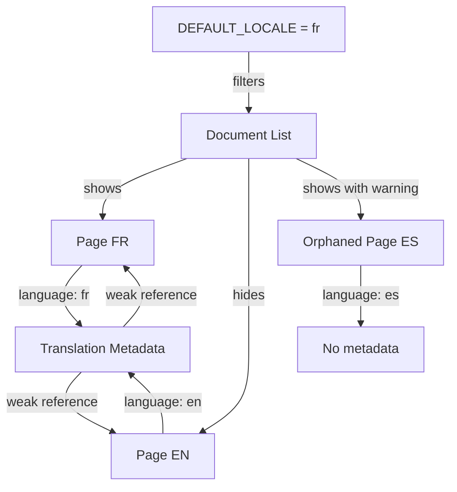

# Data Model: De-duplicate i18n Records in Sanity Studio

**Feature**: 003-dedup-studio-records  
**Date**: 2025-11-11  
**Status**: Phase 1 Complete

## Overview

This document defines the data structures and relationships for implementing language-based document list filtering in Sanity Studio. The feature does not introduce new data storage - it works with existing Sanity documents and the document-internationalization plugin's metadata structure.

## Core Entities

### 1. Translatable Document

**Definition**: Any Sanity document that supports multiple language versions.

**Key Attributes**:
- `_id`: string - Unique document identifier
- `_type`: string - Schema type (page, blog, faq, etc.)
- `language`: string - ISO language code ("fr" or "en")
- `title`: string - Document title
- `slug`: { current: string } - URL slug object

**Schema Example** (from existing `apps/studio/schemaTypes/common.ts`):
```typescript
{
  name: "language",
  type: "string",
  readOnly: true,
  hidden: true,
  description: "Language of this document",
  validation: (rule: Rule) => rule.required(),
}
```

**Document Types Supporting i18n**:
- `page` - Content pages
- `blog` - Blog posts
- `blogIndex` - Blog index singleton
- `navbar` - Navigation singleton
- `footer` - Footer singleton
- `settings` - Global settings singleton
- `homePage` - Home page singleton
- `faq` - FAQ entries

**Language Field Requirements**:
- Must be present on all i18n-enabled documents
- Must contain valid locale code from `LOCALES` array
- Set automatically by document-internationalization plugin
- Read-only and hidden in Studio UI (managed by plugin)

### 2. Translation Metadata Document

**Definition**: Special document type created by @sanity/document-internationalization plugin to link related language versions.

**Type**: `translation.metadata`

**Structure**:
```typescript
{
  _type: "translation.metadata",
  _id: string, // UUID generated by plugin
  translations: Array<{
    _key: string, // Language code (e.g., "fr", "en")
    _type: "internationalizedArrayReferenceValue",
    value: {
      _type: "reference",
      _ref: string, // Document ID
      _weak: true,
      _strengthenOnPublish: { type: string } // Schema type
    }
  }>,
  schemaTypes?: string[] // Optional: restricts which types can be referenced
}
```

**Purpose**:
- Links all language versions of the same content
- Enables Translations badge/dropdown in Studio
- Managed automatically by plugin (no manual editing)

**Example**:
```json
{
  "_type": "translation.metadata",
  "_id": "meta-abc123",
  "translations": [
    {
      "_key": "fr",
      "_type": "internationalizedArrayReferenceValue",
      "value": {
        "_type": "reference",
        "_ref": "page-innovative-fr",
        "_weak": true
      }
    },
    {
      "_key": "en",
      "_type": "internationalizedArrayReferenceValue",
      "value": {
        "_type": "reference",
        "_ref": "page-innovative-en",
        "_weak": true
      }
    }
  ]
}
```

### 3. Default Language

**Definition**: The primary language for the application, used as the canonical version in document lists.

**Source**: `@workspace/i18n-config` package

**Value**: `"fr"` (French) - First locale in LOCALES array

**Configuration**:
```typescript
// packages/i18n-config/src/index.ts
export const LOCALES = ["fr", "en"] as const;
export const DEFAULT_LOCALE = LOCALES[0]; // "fr"
```

**Usage across monorepo**:
- **Web app**: Frontend routing and translations (next-intl)
- **Studio**: Document list filtering (this feature)
- **Sanity plugin**: First language in supportedLanguages array

**Rationale**: French is default for Quebec compliance (Bill 101)

### 4. Orphaned Translation

**Definition**: A document that exists only in a non-default language without a corresponding default language version.

**Detection Criteria**:
```typescript
// Simple detection (adequate for most cases)
const isOrphaned = document.language !== DEFAULT_LOCALE;

// Advanced detection (checks for default version existence)
const hasDefaultVersion = await client.fetch(`
  *[_type == "translation.metadata" && $documentId in translations[].value._ref][0]
    .translations[_key == $defaultLanguage][0].value._ref
`, { documentId, defaultLanguage: DEFAULT_LOCALE });

const isOrphaned = document.language !== DEFAULT_LOCALE && !hasDefaultVersion;
```

**Attributes**:
- Same structure as Translatable Document
- `language` field contains non-default locale
- No sibling document with `language == DEFAULT_LOCALE`

**UI Treatment**:
- Display with warning badge in document lists
- Subtitle shows "⚠️ Orphaned translation" indicator
- Badge uses `tone="caution"` for visual distinction

## Relationships



**Key Points**:
- **1:N relationship**: One metadata document → N language versions
- **Weak references**: Prevent cascading deletes, strengthened on publish
- **Filter relationship**: DEFAULT_LOCALE determines which documents appear in lists
- **Badge relationship**: Orphaned status triggers UI warning indicator

## State Transitions

### Document Creation Flow

```
1. User creates document → Default language (FR) assigned automatically
2. User clicks "Create translation" → New document created with target language (EN)
3. Plugin creates/updates translation.metadata → Links both documents
```

### Document Deletion Flow

```
1. User deletes EN version → Metadata updated, FR version remains
2. User deletes FR version → EN becomes orphaned (no default version exists)
3. User deletes last language version → Metadata document removed automatically
```

### Language Change Flow

**Not applicable**: Language field is read-only and managed by plugin

## Data Validation Rules

### Language Field
- **Required**: true
- **Type**: string
- **Valid values**: Must be in LOCALES array ("fr" | "en")
- **Read-only**: true (managed by plugin)
- **Hidden**: true (internal field)

### Translation Metadata
- **Managed by plugin**: No manual editing allowed
- **Weak references**: Prevent document lock-in
- **Automatic cleanup**: Removed when all translations deleted

### Orphaned Documents
- **No validation errors**: Orphaned state is informational, not invalid
- **Warning only**: UI indicates issue but doesn't block operations

## GROQ Query Patterns

### Fetch Documents by Language

```groq
*[_type == $schemaType && language == $language && defined(slug.current)] {
  _id,
  title,
  "slug": slug.current,
  language
}
```

**Parameters**:
- `$schemaType`: Document type to fetch
- `$language`: Language code to filter by (usually DEFAULT_LOCALE)

### Fetch with Orphaned Handling

```groq
*[_type == $schemaType && defined(slug.current) && 
  (!defined(language) || language == $language)] {
  _id,
  title,
  "slug": slug.current,
  language
}
```

**Handles edge case**: Documents without language field (legacy data)

### Find Translation Metadata for Document

```groq
*[_type == "translation.metadata" && $documentId in translations[].value._ref][0] {
  _id,
  translations[] {
    _key,
    value {
      _ref
    }
  }
}
```

**Parameters**:
- `$documentId`: ID of the document to find translations for

### Check if Default Version Exists

```groq
*[_type == "translation.metadata" && $documentId in translations[].value._ref][0]
  .translations[_key == $defaultLanguage][0].value._ref
```

**Returns**: `_ref` of default language version, or null if doesn't exist

## Performance Considerations

### Indexing
- Language field should be indexed for fast filtering
- Sanity automatically indexes top-level string fields
- No additional index configuration needed

### Query Optimization
- Use parameterized queries ($language) for better caching
- Filter at database level (GROQ) rather than client-side
- Fetch only required fields to minimize payload

### Caching
- Sanity Content Lake caches query results
- Parameterized queries enable more effective caching
- Real-time updates work with filtered queries

## Migration Notes

### Existing Documents
- All documents already have language field (added in previous i18n migration)
- No data migration needed for this feature
- Legacy documents without language field handled by fallback filter

### New Documents
- Language field assigned automatically by plugin on creation
- Default language (FR) assigned when creating from Studio
- Translation creation flow unchanged

## Constraints and Limitations

1. **Language field is plugin-managed**:
   - Cannot be changed directly by users
   - Must use plugin's "Create translation" action

2. **Weak references in metadata**:
   - Orphaned documents possible if default version deleted
   - Not automatically cleaned up (requires manual intervention)

3. **Filtering is list-level only**:
   - Does not affect document search
   - Does not affect GROQ query playground
   - Only impacts Structure Builder document lists

4. **No bulk operations**:
   - Cannot bulk-change document languages
   - Cannot bulk-create translations
   - Each translation must be created individually

## Security and Privacy

**No additional security concerns**: Feature only changes which documents are visible in lists, not who can access them. Existing Sanity permissions and access controls remain in effect.

## Backwards Compatibility

**Fully compatible**:
- No breaking changes to data structure
- No changes to existing documents
- Existing translation workflow unchanged
- Can be rolled back by removing filter from GROQ queries

## Future Considerations

### Potential Enhancements
1. **Language selector in Studio**: Allow editors to view all languages, not just default
2. **Orphaned document cleanup**: Automatic detection and resolution workflow
3. **Bulk translation operations**: Create translations for multiple documents at once
4. **Translation progress tracking**: Show completion percentage for each language

### Scalability
- Current approach scales to 1000+ documents per type
- Additional languages (beyond 2) require only LOCALES update
- No performance degradation expected with increased document count
